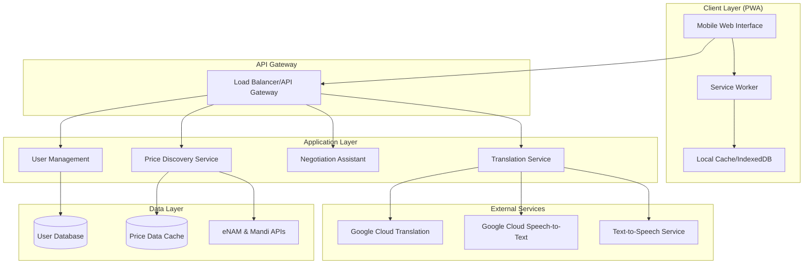

# Design Document: The Multilingual Mandi

## Overview

The Multilingual Mandi is a web-based platform that bridges language barriers in Indian local markets through real-time translation and AI-driven price discovery. The system enables seamless communication between farmers, vendors, and buyers speaking different Indian languages while providing fair pricing insights based on current market data.

The platform follows a progressive web app (PWA) architecture optimized for mobile devices and low-bandwidth environments. It integrates cloud-based translation services for high-accuracy real-time translation, local mandi data sources for price discovery, and implements offline capabilities for essential functionality in areas with intermittent connectivity.

Key design principles:
- **Mobile-first**: Optimized for smartphones with touch-friendly interfaces
- **Offline-capable**: Core functionality available without internet connectivity  
- **Low-bandwidth optimized**: Efficient data usage for 2G/3G networks
- **Culturally sensitive**: Respects local market practices and negotiation norms
- **Privacy-focused**: Minimal data collection with user control over sharing

## Architecture

The system follows a layered architecture with clear separation between presentation, business logic, and data layers:



### Component Responsibilities

**Client Layer (PWA)**:
- Responsive mobile web interface optimized for touch interaction
- Service worker for offline functionality and caching
- Local storage for user preferences and cached data
- Audio recording and playback for speech features

**API Gateway**:
- Request routing and load balancing
- Rate limiting and authentication
- Request/response transformation
- Monitoring and logging

**Application Services**:
- Translation Service: Orchestrates speech-to-text, translation, and text-to-speech
- Price Discovery Service: Aggregates and analyzes mandi price data
- Negotiation Assistant: Provides AI-powered negotiation suggestions
- User Management: Handles authentication and user preferences

## Components and Interfaces

### Translation Engine

The Translation Engine handles the complete speech translation pipeline:

**Core Components**:
- **Speech Recognition Module**: Converts speech to text using Google Cloud Speech-to-Text V2 with Chirp 3 model
- **Translation Module**: Translates text between supported Indian languages using Google Cloud Translation
- **Text-to-Speech Module**: Converts translated text back to speech
- **Language Detection**: Automatically detects source language when not specified
- **Confidence Scoring**: Evaluates translation quality and requests clarification when needed

**Supported Languages**:
- Hindi (hi-IN)
- Tamil (ta-IN)
- Telugu (te-IN)
- Bengali (bn-IN)
- Marathi (mr-IN)
- Kannada (kn-IN)

**Interface**:
```typescript
interface TranslationEngine {
  translateSpeech(audioBlob: Blob, sourceLang: string, targetLang: string): Promise<TranslationResult>
  translateText(text: string, sourceLang: string, targetLang: string): Promise<TranslationResult>
  detectLanguage(audioBlob: Blob): Promise<LanguageDetectionResult>
  synthesizeSpeech(text: string, language: string): Promise<AudioBlob>
}

interface TranslationResult {
  originalText: string
  translatedText: string
  confidence: number
  audioUrl?: string
  requiresVerification: boolean
}
```

### Price Discovery System

The Price Discovery System aggregates market data from multiple sources to provide fair pricing insights:

**Data Sources**:
- eNAM (Electronic National Agriculture Market) API
- State Agricultural Marketing Board APIs
- Local mandi price feeds
- Historical price databases

**Core Features**:
- Real-time price aggregation from multiple sources
- Price validation and outlier detection
- Seasonal trend analysis
- Quality grade adjustments
- Regional price variations

**Interface**:
```typescript
interface PriceDiscoverySystem {
  getCurrentPrices(product: string, location: string): Promise<PriceData>
  getPriceHistory(product: string, location: string, days: number): Promise<PriceHistory>
  validatePrice(product: string, proposedPrice: number, location: string): Promise<PriceValidation>
  getPriceTrends(product: string, location: string): Promise<PriceTrends>
}

interface PriceData {
  product: string
  location: string
  minPrice: number
  avgPrice: number
  maxPrice: number
  lastUpdated: Date
  sources: string[]
  qualityGrades: QualityPrice[]
}
```

### Negotiation Assistant

The Negotiation Assistant provides AI-powered suggestions while preserving human decision-making:

**Core Features**:
- Market condition analysis
- Fair price range suggestions
- Cultural negotiation pattern recognition
- Win-win outcome optimization
- Alternative proposal generation

**Interface**:
```typescript
interface NegotiationAssistant {
  analyzeDeal(product: string, quantity: number, proposedPrice: number, location: string): Promise<DealAnalysis>
  suggestCounterOffer(currentOffer: number, marketData: PriceData): Promise<NegotiationSuggestion>
  getAlternatives(stalledNegotiation: NegotiationContext): Promise<Alternative[]>
}

interface NegotiationSuggestion {
  suggestedPrice: number
  reasoning: string
  confidence: number
  culturalContext: string
  preservesRelationship: boolean
}
```

### Offline Capability Module

Enables core functionality without internet connectivity:

**Offline Features**:
- Cached translation models for common phrases
- Local price data with timestamps
- Basic negotiation suggestions
- User preference storage

**Sync Strategy**:
- Background sync when connectivity returns
- Conflict resolution for offline changes
- Progressive data updates
- Bandwidth-aware synchronization

## Data Models

### User Model
```typescript
interface User {
  id: string
  phoneNumber: string
  preferredLanguage: string
  location: {
    state: string
    district: string
    market?: string
  }
  userType: 'farmer' | 'vendor' | 'buyer'
  privacySettings: PrivacySettings
  createdAt: Date
  lastActive: Date
}

interface PrivacySettings {
  shareLocationData: boolean
  shareTransactionHistory: boolean
  allowDataAnalytics: boolean
  marketingCommunications: boolean
}
```

### Product Model
```typescript
interface Product {
  id: string
  name: string
  category: string
  localNames: Record<string, string> // language code -> local name
  standardUnits: string[]
  qualityGrades: string[]
  seasonality: {
    peakMonths: number[]
    offSeasonMonths: number[]
  }
}
```

### Transaction Session Model
```typescript
interface TransactionSession {
  id: string
  participants: User[]
  product: Product
  quantity: number
  unit: string
  proposedPrice: number
  finalPrice?: number
  status: 'active' | 'completed' | 'cancelled'
  messages: TranslationMessage[]
  negotiationHistory: NegotiationStep[]
  createdAt: Date
  completedAt?: Date
}

interface TranslationMessage {
  id: string
  senderId: string
  originalText: string
  originalLanguage: string
  translations: Record<string, string>
  audioUrl?: string
  timestamp: Date
  confidence: number
}
```

### Market Data Model
```typescript
interface MarketData {
  id: string
  product: string
  market: string
  date: Date
  prices: {
    min: number
    max: number
    modal: number
    average: number
  }
  arrivals: number
  unit: string
  source: string
  qualityDistribution: Record<string, number>
  lastUpdated: Date
}
```

## Correctness Properties

*A property is a characteristic or behavior that should hold true across all valid executions of a system—essentially, a formal statement about what the system should do. Properties serve as the bridge between human-readable specifications and machine-verifiable correctness guarantees.*

### Property 1: Translation Performance Consistency
*For any* supported Indian language pair and any valid audio or text input, the translation pipeline (speech-to-text, translation, text-to-speech) should complete within the specified time limits (2 seconds for speech recognition, 1 second for translation, 1 second for speech synthesis)
**Validates: Requirements 1.1, 1.2, 1.3**

### Property 2: Translation Confidence Verification
*For any* translation with confidence below 80%, the system should display both original and translated text for user verification
**Validates: Requirements 1.5**

### Property 3: Bidirectional Translation Completeness
*For any* two supported languages, translation should work in both directions with equivalent accuracy and performance
**Validates: Requirements 1.6**

### Property 4: Price Retrieval Performance
*For any* valid product and location query, the price discovery system should return current market prices within 5 seconds
**Validates: Requirements 2.1**

### Property 5: Price Data Fallback Consistency
*For any* product query where local data is unavailable, the system should provide regional and national price averages as fallback
**Validates: Requirements 2.2**

### Property 6: Price Display Completeness
*For any* price query result, the display should include minimum, average, and maximum prices for the past 7 days, along with data source and last update timestamp
**Validates: Requirements 2.3, 2.7**

### Property 7: Data Staleness Warning
*For any* price data older than 24 hours, the system should display a staleness warning to users
**Validates: Requirements 2.5**

### Property 8: Mobile Interface Responsiveness
*For any* screen width down to 320px, the platform should load and function properly with touch-friendly buttons (minimum 44px height) and readable fonts (minimum 16px)
**Validates: Requirements 3.1, 3.2, 3.3**

### Property 9: User Interaction Feedback
*For any* user interaction with the interface, the system should provide clear visual and audio feedback
**Validates: Requirements 3.4**

### Property 10: Network Optimization
*For any* network condition, the platform should minimize data usage through image optimization and efficient data formats, and show loading indicators during slow connections
**Validates: Requirements 3.5, 3.6**

### Property 11: Negotiation Context Awareness
*For any* negotiation scenario, the assistant should provide suggestions based on current market conditions, product quality, quantity, and seasonal factors
**Validates: Requirements 4.1, 4.2**

### Property 12: Human Autonomy Preservation
*For any* negotiation suggestion, the system should not override or automatically execute user decisions
**Validates: Requirements 4.5**

### Property 13: Offline Mode Transition
*For any* network connectivity change, the platform should automatically switch to offline mode when disconnected and provide basic functionality using cached data
**Validates: Requirements 5.1, 5.2, 5.3**

### Property 14: Offline Synchronization
*For any* offline activities, the system should queue actions and sync them when connectivity is restored, updating cached data appropriately
**Validates: Requirements 5.4, 5.6**

### Property 15: Data Source Integration Reliability
*For any* conflicting price data from multiple sources, the system should use weighted averages based on source reliability and validate data for outliers
**Validates: Requirements 6.2, 6.3, 6.4**

### Property 16: Authentication Security
*For any* user registration or login, the system should use phone number-based OTP verification and collect only essential information
**Validates: Requirements 7.1, 7.2**

### Property 17: Data Encryption Consistency
*For any* user data, the system should encrypt information both in transit and at rest
**Validates: Requirements 7.3**

### Property 18: Privacy Control Availability
*For any* user, the platform should provide options to control data sharing and privacy settings
**Validates: Requirements 7.6**

### Property 19: Performance Under Load
*For any* system load condition, critical functions should maintain response times under 3 seconds and the system should auto-scale resources based on demand
**Validates: Requirements 8.2, 8.3**

### Property 20: Accessibility Feature Completeness
*For any* user with accessibility needs, the platform should provide voice navigation, screen reader support, high-contrast modes, and audio-only interaction capabilities
**Validates: Requirements 9.1, 9.2, 9.3**

### Property 21: Visual Aid Consistency
*For any* text displayed on the platform, appropriate visual icons and symbols should be provided alongside text for better comprehension
**Validates: Requirements 9.5**

### Property 22: Feedback Mechanism Availability
*For any* platform feature (translations, price suggestions, negotiations), users should have access to simple feedback mechanisms like thumbs up/down or star ratings
**Validates: Requirements 10.1, 10.3, 10.5**

### Property 23: Feedback-Driven Improvement
*For any* feedback data collected, the system should use it to retrain AI models and prioritize improvements in areas with reported issues
**Validates: Requirements 10.4, 10.6**

## Error Handling

The system implements comprehensive error handling across all components:

### Translation Engine Error Handling
- **Audio Quality Issues**: When speech recognition confidence is low, request user to repeat
- **Translation Failures**: Fallback to simpler translation models or request manual input
- **Network Timeouts**: Cache partial results and retry with exponential backoff
- **Language Detection Errors**: Prompt user to manually select source language

### Price Discovery Error Handling
- **Data Source Failures**: Automatic failover to alternative mandi data sources
- **Stale Data**: Clear warnings when data is older than acceptable thresholds
- **Invalid Price Data**: Outlier detection and validation before display
- **API Rate Limits**: Intelligent request queuing and caching strategies

### Offline Mode Error Handling
- **Sync Conflicts**: Timestamp-based conflict resolution with user notification
- **Storage Limits**: Intelligent cache eviction based on usage patterns
- **Partial Sync Failures**: Retry mechanisms with user feedback on sync status

### User Interface Error Handling
- **Network Connectivity**: Graceful degradation with clear user communication
- **Browser Compatibility**: Feature detection with fallbacks for older browsers
- **Touch/Voice Input Failures**: Alternative input methods with clear instructions

## Testing Strategy

The testing approach combines unit testing for specific functionality with property-based testing for comprehensive coverage:

### Unit Testing Focus Areas
- **Authentication flows**: OTP generation, verification, and session management
- **Data validation**: Price data outlier detection and source reliability scoring
- **UI component behavior**: Button interactions, form validation, responsive design
- **Error scenarios**: Network failures, invalid inputs, edge cases

### Property-Based Testing Configuration
- **Testing Framework**: Use Hypothesis (Python) or fast-check (JavaScript) for property-based tests
- **Test Iterations**: Minimum 100 iterations per property test to ensure comprehensive coverage
- **Test Data Generation**: 
  - Random audio samples in supported languages for translation testing
  - Generated price data with various market conditions for price discovery testing
  - Simulated network conditions for offline/online behavior testing
  - Random user interactions for UI responsiveness testing

### Property Test Implementation
Each correctness property will be implemented as a property-based test with the following tag format:
- **Feature: multilingual-mandi, Property 1: Translation Performance Consistency**
- **Feature: multilingual-mandi, Property 2: Translation Confidence Verification**
- And so on for all 23 properties

### Integration Testing
- **End-to-end translation workflows**: Complete speech-to-speech translation cycles
- **Price discovery integration**: Real mandi data source integration testing
- **Offline-online transitions**: Network state change handling
- **Cross-browser compatibility**: Testing on Android 7.0+ with various browsers

### Performance Testing
- **Load testing**: 10,000 concurrent users during peak market hours
- **Bandwidth testing**: 2G/3G network simulation for rural connectivity
- **Response time validation**: Sub-3-second response times under load
- **Memory usage**: Efficient caching and data management validation

### Accessibility Testing
- **Screen reader compatibility**: NVDA, JAWS, and mobile screen reader testing
- **Voice navigation**: Complete workflow testing using only voice commands
- **High contrast mode**: Visual accessibility validation
- **Touch target sizing**: Minimum 44px button height verification

The dual testing approach ensures both specific functionality correctness (unit tests) and universal behavior validation (property tests), providing comprehensive coverage for the multilingual marketplace platform.